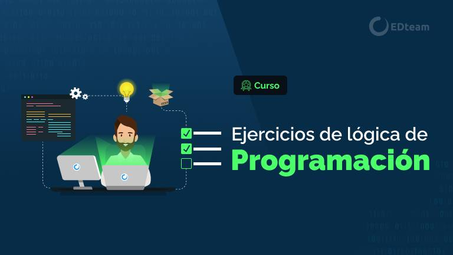

### Ejercicios de Programación para Practicar Lógica
---
###### Por ➡ Natalia Cortés
---

⚠ ADVERTENCIA DEBERÁS CREAR UNA RAMA CON TU NOMBRE ⚠

1. **Saludo Personalizado:**
   - Solicita al usuario su nombre y salúdalo por su nombre.

2. **Suma de Dos Números:**
   - Pide al usuario que ingrese dos números y muestra la suma de ambos.

3. **Área de un Triángulo:**
   - Pide la base y la altura de un triángulo y calcula su área.

4. **Conversión de Grados Celsius a Fahrenheit:**
   - Pregunta al usuario por una temperatura en grados Celsius y conviértela a Fahrenheit.

5. **Verificación de Número Par o Impar:**
   - Solicita un número e indica si es par o impar.

6. **Calculadora de IMC:**
   - Pide el peso y la altura del usuario, luego calcula su Índice de Masa Corporal (IMC).

7. **Tabla de Multiplicar:**
   - Pide un número y muestra su tabla de multiplicar del 1 al 10.

8. **Factorial de un Número:**
   - Solicita un número y calcula su factorial.

9. **Días a Segundos:**
   - Pide al usuario una cantidad de días y conviértela a segundos.

10. **Contador de Vocales:**
    - Ingresa una palabra y cuenta cuántas vocales contiene.

11. **Reverso de un Número:**
    - Solicita un número y muestra su reverso.

12. **Cadena al Revés:**
    - Pide una cadena de texto y muestra la cadena al revés.

13. **Número Primo:**
    - Pregunta por un número e indica si es primo o no.

14. **Suma de Números Pares:**
    - Pide un rango de números y suma solo los números pares dentro de ese rango.

15. **Conversión de Moneda:**
    - Pregunta al usuario por una cantidad de dinero en una moneda y conviértela a otra.

16. **Calificación de Notas:**
    - Pide una calificación numérica y devuelve la calificación en formato de letra (A, B, C, D, F).

17. **Ordenar Tres Números:**
    - Solicita tres números e imprímelos en orden ascendente.

18. **Calculadora de Descuento:**
    - Pide el precio original y el porcentaje de descuento, luego calcula el precio final.

19. **Generador de Contraseñas:**
    - Crea un programa que genere contraseñas aleatorias de 8 caracteres.

20. **Comparación de Cadenas:**
    - Pide dos cadenas de texto y compara si son iguales o diferentes.

## Organización
La estructura de carpetas deberá seguir la siguiente organización 
**en python:**
- practica-tu-logica/
|-- src/
|   |-- 01_saludo_personalizado.py
|   |-- 02_suma_dos_numeros.py
|   |-- 03_area_triangulo.py
|   |-- 04_conversion_celsius_fahrenheit.py
|   |-- 05_numero_par_o_impar.py
|   |-- 06_calculadora_imc.py
|   |-- 07_tabla_multiplicar.py
|   |-- 08_factorial_numero.py
|   |-- 09_dias_a_segundos.py
|   |-- 10_contador_vocales.py
|   |-- 11_reverso_numero.py
|   |-- 12_cadena_al_reves.py
|   |-- 13_numero_primo.py
|   |-- 14_suma_numeros_pares.py
|   |-- 15_conversion_moneda.py
|   |-- 16_calificacion_notas.py
|   |-- 17_ordenar_tres_numeros.py
|   |-- 18_calculadora_descuento.py
|   |-- 19_generador_contraseñas.py
|   |-- 20_comparacion_cadenas.py
|-- test/
|   |-- test_main.py
|-- README.md

**En kotlin**
- Ejercicios/
|-- src/
|   |-- 01_SaludoPersonalizado.kt
|   |-- 02_SumaDosNumeros.kt
|   |-- 03_AreaTriangulo.kt
|   |-- 04_ConversionCelsiusFahrenheit.kt
|   |-- 05_NumeroParOImpar.kt
|   |-- 06_CalculadoraIMC.kt
|   |-- 07_TablaMultiplicar.kt
|   |-- 08_FactorialNumero.kt
|   |-- 09_DiasASegundos.kt
|   |-- 10_ContadorVocales.kt
|   |-- 11_ReversoNumero.kt
|   |-- 12_CadenaAlReves.kt
|   |-- 13_NumeroPrimo.kt
|   |-- 14_SumaNumerosPares.kt
|   |-- 15_ConversionMoneda.kt
|   |-- 16_CalificacionNotas.kt
|   |-- 17_OrdenarTresNumeros.kt
|   |-- 18_CalculadoraDescuento.kt
|   |-- 19_GeneradorContrasenas.kt
|   |-- 20_ComparacionCadenas.kt
|-- test/
|   |-- test_main.kt
|-- README.md

